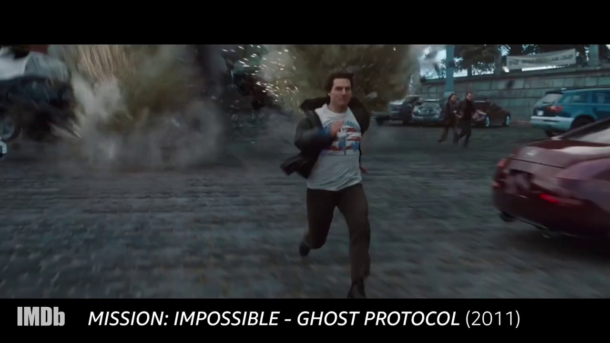

# Pose detection + Classification using Yolov8 and Keras

## How it works

Original image  

Keypoints prediction by a pretrained Yolov8 model  

Pose prediction by a trained Keras classification model  

## Sample output

[Sample 1](./files/tom_cruise_processed.gif)

[Sample 2](./files/graham_norton_processed.gif)

## How to use

Go through the Jupyter notebook which covers:
- Retrieving frames of a video
- Using Yolov8
- Preparing a dataset for a few pose classes
- Training a Keras classification model
    - For model tracking, there is an optional integration with MLflow
- Inference on images and videos